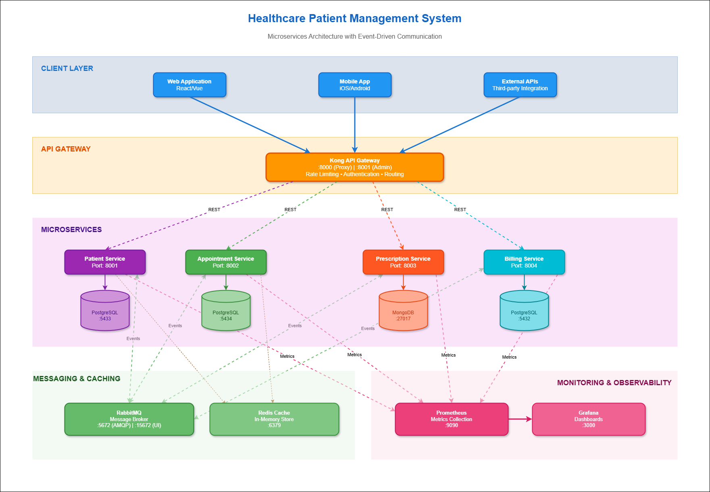

<div align="center">
  <h1>MediFlow - a Healthcare Patient Management System</h1>

  <p>
    MediFlow is a distributed microservices-based healthcare platform managing patient records, appointments, prescriptions, and billing with FHIR R4 compatibility considerations.
  </p>

[](https://opensource.org/licenses/MIT)

</div>

## About The Project



This is a **distributed healthcare management system** built with 4 independent microservices implementing the Database-per-Service pattern. Developed as an academic project for COMP41720, it demonstrates architectural trade-offs in distributed systems design, asynchronous messaging, API gateway patterns, and observability.

**Key Features:**

- **Patient Service**: Manages patient demographics, medical history, and authentication (JWT)
- **Appointment Service**: Handles scheduling, availability, and slot management
- **Prescription Service**: Stores medication records and clinical documents
- **Billing Service**: Generates invoices, processes payments, and manages insurance claims

**Architecture Highlights:**

- Database-per-Service pattern with PostgreSQL (Patient, Appointment, Billing) and MongoDB (Prescription)
- Hybrid communication: Synchronous REST APIs for queries, Asynchronous RabbitMQ for event-driven workflows
- Kong API Gateway for centralized routing and JWT validation
- **Circuit Breaker Pattern** for fault tolerance and cascading failure prevention
- Prometheus + Grafana for metrics and monitoring
- FHIR R4-compatible schemas (Patient, Appointment, Invoice, MedicationRequest resources)

See [Architecture Decision Records](docs/adr) for detailed trade-off analysis.

## Project Report and Video

The full project report is available in the root folder: [Project Report](MediFlowReport.pdf)
Watch the video showcasing the project here:

[Project Demo Video](https://ucd-ie.zoom.us/rec/share/Yc8NpASAfmOKLYOz_atM08eou5LPjVTW9lii7JNetPJmiuE4blrBgRb5rHcqcVn8.OGhG3Sa4Z9UAOcaQ?startTime=1765910669000)

```
https://ucd-ie.zoom.us/rec/share/Yc8NpASAfmOKLYOz_atM08eou5LPjVTW9lii7JNetPJmiuE4blrBgRb5rHcqcVn8.OGhG3Sa4Z9UAOcaQ?startTime=1765910669000
```

**Passcode**: `=8+*&l97`

### Project Structure

```
mediflow/
├── client/                     # Next.js 14 frontend (port 3001)
├── services/                   # Microservices
│   ├── patient-service/        # Patient management (port 8001)
│   ├── appointment-service/    # Appointment scheduling (port 8002)
│   ├── prescription-service/   # Medication records (port 8003)
│   └── billing-service/        # Invoicing & payments (port 8004)
├── common/                     # Shared libraries
│   ├── auth/                   # JWT validation
│   ├── logging/                # structlog configuration
│   ├── messaging/              # RabbitMQ publisher/consumer
│   ├── exceptions/             # Custom exceptions
│   ├── middleware/             # Error handlers
│   ├── models/                 # Shared Pydantic types
│   └── utils/                  # Retry logic, helpers
├── kubernetes/                 # K8s manifests
│   ├── namespace.yaml
│   ├── infrastructure/         # RabbitMQ, Redis, Prometheus, Grafana, Kong
│   ├── patient-service/        # Patient service K8s resources
│   ├── appointment-service/
│   ├── prescription-service/
│   └── billing-service/
├── monitoring/                 # Observability stack
│   ├── prometheus/             # Metrics collection (recording rules, alerts)
│   └── grafana/                # Dashboards & provisioning
├── scripts/                    # Automation scripts
│   ├── docker_manage.sh        # Docker Compose management
│   ├── k8s_manage.sh           # Kubernetes deployment
│   ├── e2e_test_all_services.sh # End-to-end testing
│   ├── test_k8s_deployment.sh  # K8s deployment verification
│   └── init_*_db.*             # Database initialization
├── tests/                      # Test suites
│   ├── patient/
│   ├── appointment/
│   ├── prescription/
│   └── billing/
├── docs/                       # Documentation & ADRs
├── kong/                       # Kong API Gateway config
├── docker-compose.yml          # Full stack orchestration
└── Pipfile                     # Python dependencies
```

## Built With

**Core Stack:**

- **Language**: Python 3.11
- **Framework**: FastAPI with Pydantic validation
- **ORM**: SQLAlchemy (async/sync)
- **Messaging**: RabbitMQ (aio-pika client)
- **Caching**: Redis
- **API Gateway**: Kong 3.3.1 (DB-less mode)
- **Monitoring**: Prometheus + Grafana
- **Logging**: structlog (JSON format)
- **Testing**: pytest with coverage

**Infrastructure:**

- **Containerization**: Docker with multi-stage builds
- **Orchestration**: Kubernetes (tested with Minikube)
- **Databases**: PostgreSQL 17, MongoDB 8.2
- **Package Manager**: pipenv

**Frontend:**

- **Framework**: Next.js 14 with TypeScript
- **Styling**: Tailwind CSS v4
- **State Management**: React Query (TanStack Query)
- **Validation**: Zod schemas

## Getting Started

### Recommended Deployment Approach

**For quick setup and testing, use the provided automation scripts:**

- `scripts/docker_manage.sh` - Automated Docker Compose deployment (recommended for local full-stack testing)
- `scripts/k8s_manage.sh` - Automated Kubernetes deployment (recommended for production-like environment)

These scripts handle infrastructure setup, service builds, database initialization, and health checks automatically. Local development is suitable for individual service development but requires manual configuration.

### Prerequisites

Choose one deployment method:

**Local Development:**

- Python 3.11+
- pipenv
- PostgreSQL 17 / MongoDB 8.2 (or use Docker for databases)
- RabbitMQ, Redis (or use Docker)

**Docker Compose:**

- Docker Engine 20.10+
- Docker Compose v2.0+

**Kubernetes:**

- Minikube 1.30+
- kubectl 1.27+
- 4GB RAM minimum

### Installation

#### Method 1: Local Development (Individual Services)

1. Clone the repository

```bash
git clone https://github.com/vijethph/mediflow.git
cd mediflow
```

2. Install dependencies

```bash
pipenv install
pipenv shell
```

3. Set up databases (example: Patient Service)

```bash
# Start PostgreSQL (or use existing instance)
docker run -d --name patient-db -p 5433:5432 \
  -e POSTGRES_PASSWORD=patient_secure_password \
  -e POSTGRES_DB=patient_db postgres:17-alpine

# Initialize schema
./scripts/init_patient_db.sh
```

4. Start infrastructure services

```bash
# RabbitMQ
docker run -d --name rabbitmq -p 5672:5672 -p 15672:15672 \
  -e RABBITMQ_DEFAULT_USER=admin \
  -e RABBITMQ_DEFAULT_PASS=rabbitmq_secure_password \
  rabbitmq:4.0-management-alpine

# Redis
docker run -d --name redis -p 6379:6379 redis:8-alpine
```

5. Configure environment variables

```bash
cd services/patient-service
cp .env.example .env
# Edit .env: set DATABASE_URL, JWT_SECRET, RABBITMQ_URL, etc.
```

6. Run the service

```bash
python main.py
# or: uvicorn main:app --host 0.0.0.0 --port 8001 --reload
```

7. Access API documentation: `http://localhost:8001/docs`

Repeat steps 3-7 for other services (ports: 8002 appointment, 8003 prescription, 8004 billing).

#### Method 2: Docker Compose (Full Stack) - **RECOMMENDED**

**Using automation script (preferred):**

```bash
# Start all services
./scripts/docker_manage.sh start all

# Test all endpoints
./scripts/docker_manage.sh test all

# View logs
./scripts/docker_manage.sh logs patient-service

# Clean up
./scripts/docker_manage.sh clean
```

**Running Frontend (Client Application):**

The frontend runs separately and connects to backend services via Kong API Gateway.

```bash
# Navigate to client directory
cd client

# Install dependencies
npm install

# Create environment file
cat > .env.local << EOF
NEXT_PUBLIC_API_URL=http://localhost:8000
EOF

# Start development server
npm run dev
# Frontend runs on http://localhost:3001

# For production build
npm run build
npm start
```

**Prerequisites**: Backend services and Kong Gateway must be running (use Docker Compose or Kubernetes for easy setup).

**Manual approach:**

1. Clone repository (same as above)

2. Create environment file

```bash
cp .env.example .env
# Edit .env to set JWT_SECRET and other passwords
```

3. Start all services

```bash
docker-compose up -d
```

4. Verify health

5. Access services:

- Frontend Application: `http://localhost:3001`
- Patient API: `http://localhost:8001/docs`
- Appointment API: `http://localhost:8002/docs`
- Prescription API: `http://localhost:8003/docs`
- Billing API: `http://localhost:8004/docs`
- RabbitMQ Management: `http://localhost:15672` (admin/rabbitmq_secure_password)
- Prometheus: `http://localhost:9090`
- Grafana: `http://localhost:3000` (admin/admin)

6. Shutdown

```bash
docker-compose down
# To remove volumes: docker-compose down -v
```

#### Method 3: Kubernetes (Minikube) - **RECOMMENDED**

**Using automation script (preferred):**

```bash
# Start Minikube
minikube start --cpus 4 --memory 8192
eval $(minikube docker-env)
minikube addons enable metrics-server

# Deploy infrastructure (RabbitMQ, Redis, Prometheus, Grafana, Kong)
./scripts/k8s_manage.sh infra

# Build service images
./scripts/k8s_manage.sh build

# Deploy all services
./scripts/k8s_manage.sh deploy

# Test deployment
./scripts/k8s_manage.sh test
# or: ./scripts/test_k8s_deployment.sh

# Access Kong gateway
minikube service -n kong kong-proxy --url
# Use URL with /patient/docs, /billing/docs, etc.

# Clean up
./scripts/k8s_manage.sh clean
```

**Manual approach:**

1. Start Minikube

```bash
minikube start --cpus 4 --memory 4096
```

2. Create namespace and deploy infrastructure

```bash
kubectl apply -f kubernetes/namespace.yaml
kubectl apply -f kubernetes/infrastructure/
```

3. Deploy services

```bash
kubectl apply -f kubernetes/patient-service/
kubectl apply -f kubernetes/appointment-service/
kubectl apply -f kubernetes/prescription-service/
kubectl apply -f kubernetes/billing-service/
```

4. Verify deployment

```bash
# Check pods
kubectl get pods -n healthcare

# Check services
kubectl get svc -n healthcare

# View logs
kubectl logs -n healthcare -l app=patient-service -f
```

5. Access services (use port-forward or NodePort)

```bash
kubectl port-forward -n healthcare svc/patient-service 8001:8001
kubectl port-forward -n healthcare svc/grafana 3000:3000
kubectl port-forward -n healthcare svc/prometheus 9090:9090
```

6. Run tests

```bash
./scripts/test_k8s_deployment.sh
```

7. Cleanup

```bash
kubectl delete namespace healthcare
minikube stop
```

## Usage

### Common Operations

**Testing Individual Endpoints:**

```bash
# Register a patient
curl -X POST http://localhost:8001/api/v1/patients \
  -H "Content-Type: application/json" \
  -d '{"name": [{"family": "Smith", "given": ["John"]}], "gender": "male", "birthDate": "1990-01-01"}'

# Create appointment
curl -X POST http://localhost:8002/api/v1/appointments \
  -H "Authorization: Bearer <jwt_token>" \
  -H "Content-Type: application/json" \
  -d '{"patient_id": "uuid", "start": "2024-12-20T10:00:00Z", "end": "2024-12-20T10:30:00Z", "status": "proposed"}'

# View Grafana dashboards
# Navigate to http://localhost:3000 → Dashboards → Healthcare System
```

**Monitoring:**

- **Prometheus Metrics**: `http://localhost:9090/targets` (check service health)
- **Grafana Dashboards**: System Overview, Patient Service, Appointment Service, Prescription Service, RabbitMQ
- **RabbitMQ Queues**: `http://localhost:15672/#/queues` (monitor event processing)

**Database Access:**

```bash
# Patient DB
docker exec -it healthcare-patient-db psql -U postgres -d patient_db

# Prescription DB
docker exec -it healthcare-prescription-db mongosh -u admin -p mongo_secure_password
```

**Running Tests:**

```bash
# E2E tests (all services) - Docker Compose
./scripts/e2e_test_all_services.sh

# Kubernetes deployment tests
./scripts/test_k8s_deployment.sh

# Unit tests (individual service)
pipenv shell
pytest tests/billing/test_service.py -v

# Integration tests
pytest tests/billing/test_integration.py -v

# With coverage
pytest --cov=services/billing-service --cov-report=html
```

**Monitoring Setup:**

The system includes comprehensive monitoring with Prometheus and Grafana:

```bash
# Access monitoring dashboards (Docker Compose)
# Prometheus: http://localhost:9090
# Grafana: http://localhost:3000 (admin/admin)

# Access monitoring (Kubernetes)
kubectl port-forward -n healthcare svc/prometheus 9090:9090
kubectl port-forward -n healthcare svc/grafana 3000:3000
```

**Available Grafana Dashboards:**

- System Overview - All services health, request rates, latency
- Patient Service Dashboard - Patient API metrics, database performance
- Appointment Service Dashboard - Scheduling metrics, slot availability
- Prescription Service Dashboard - Clinical records metrics
- Billing Service Dashboard - Invoice generation, payment processing
- RabbitMQ Dashboard - Message queue monitoring, event processing

**Prometheus Features:**

- Recording rules for pre-aggregated metrics (request rates, p95 latency, error rates)
- Alert rules for critical issues (ServiceDown, HighErrorRate, HighLatency)
- Service discovery for automatic metric collection
- Custom metrics from each microservice (/metrics endpoint)

**Management Scripts:**

- `docker_manage.sh` - Start, stop, test, view logs for Docker Compose setup
- `k8s_manage.sh` - Deploy, build, test, clean Kubernetes resources
- `e2e_test_all_services.sh` - Comprehensive end-to-end API testing
- `test_k8s_deployment.sh` - Verify Kubernetes deployment health

## Contributing

This is an academic project for COMP41720. For educational purposes:

1. Fork the repository
2. Create a feature branch (`git checkout -b feature/ServiceName`)
3. Follow conventions: reStructuredText docstrings, Black formatter, Pylint linting
4. Write tests for new features
5. Document architectural decisions in `docs/adr/` if making significant changes
6. Commit with conventional commit format (`feat(service): description`)
7. Push and create a Pull Request

## License

Distributed under the Apache 2.0 License. See `LICENSE` for more information.

## Contact

Project Link: [https://github.com/vijethph/mediflow](https://github.com/vijethph/mediflow)

## Acknowledgments

- [FastAPI](https://fastapi.tiangolo.com/) - Modern Python web framework
- [FHIR R4 Specification](https://www.hl7.org/fhir/) - Healthcare data standards
- [Kong API Gateway](https://konghq.com/) - Cloud-native API gateway
- [Best-README-Template](https://github.com/othneildrew/Best-README-Template) - README structure
